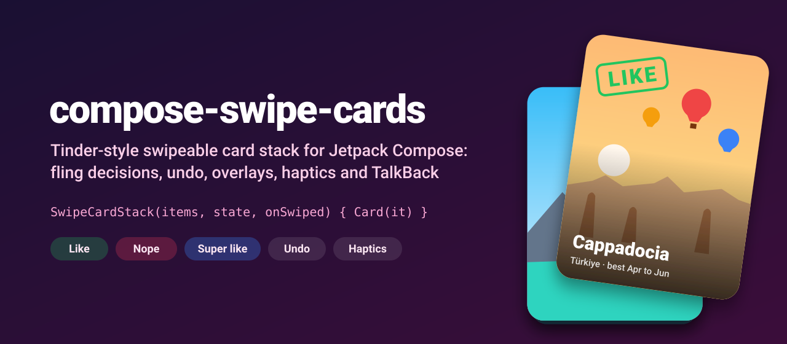
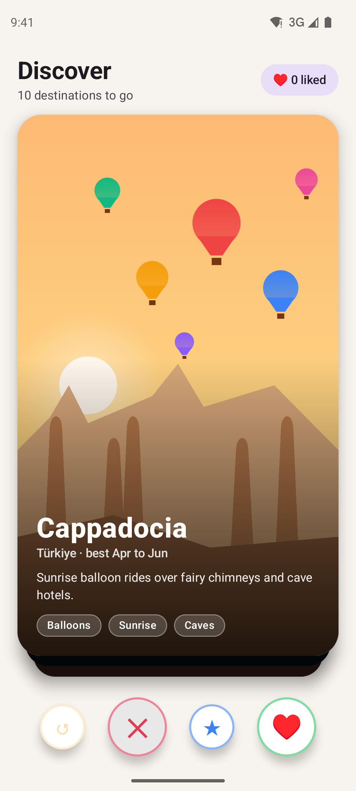
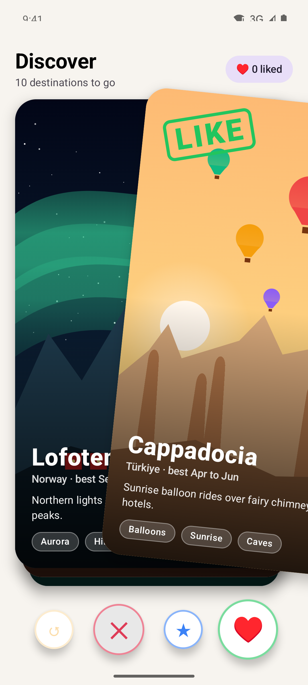
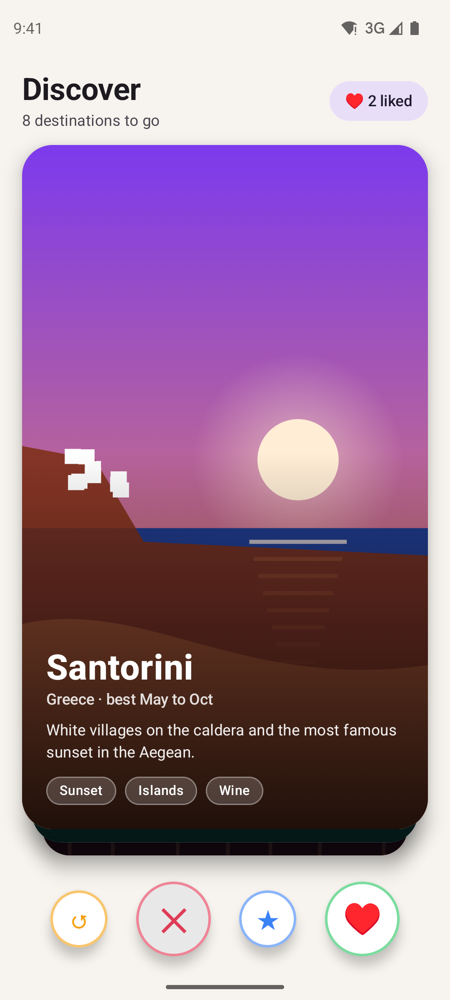
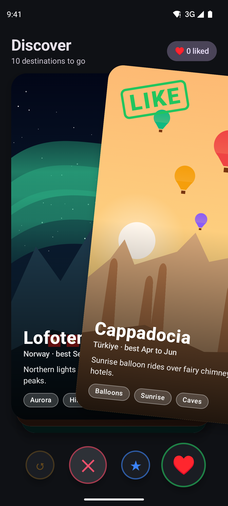

<p align="center">
  
</p>

<p align="center">
  <a href="https://github.com/halilozel1903/compose-swipe-cards/actions/workflows/ci.yml"></a>
  <a href="https://jitpack.io/#halilozel1903/compose-swipe-cards"></a>
  
  
  
  <a href="LICENSE"></a>
</p>

**compose-swipe-cards** is a Tinder-style swipeable card stack for Jetpack Compose. Drag the top card and it tilts with your finger, a LIKE / NOPE / SUPER label fades in as you get closer to the threshold, and a haptic tick tells you when letting go will count. Release past the threshold or fling it fast and the card flies off; otherwise it springs back. Buttons can swipe and undo with the same animations, and TalkBack users get "Like", "Nope" and "Undo" actions.

```kotlin
val state = rememberSwipeCardState()

SwipeCardStack(destinations, state, onSwiped = { destination, direction -> save(destination, direction) }) { destination ->
    DestinationCard(destination)
}
```

## Screenshots

Captured from the sample app on an Android emulator by CI.

| The deck | Dragging right | After two likes | Dark mode |
| :---: | :---: | :---: | :---: |
|  |  |  |  |

## Why

A swipe deck looks simple until you build one: the card should follow the finger, rotate naturally, decide on **distance or velocity** (a quick flick should count), refuse a card that is thrown back towards the center, keep the cards behind it moving in sync, support undo without a jump, and still be usable with TalkBack. compose-swipe-cards does all of that in one composable, and keeps the decision logic in a plain Kotlin module with unit tests.

## Features

- 🃏 **`SwipeCardStack(items, state, onSwiped) { item -> }`**: the top N cards with scale and offset depth; the cards behind move up smoothly while you drag.
- 👉 **Drag with rotation** proportional to the horizontal offset.
- ⚖️ **Distance or velocity** decisions: 30 % of the card's size, or a fling faster than 1000 dp/s. A card thrown back towards the center is kept. Both thresholds are configurable.
- ↔️ **Directions**: left (nope), right (like) and up (super like) by default; any subset of left, right, up and down.
- 🌀 **Spring-back** below the threshold, **fly-off** animation above it, off screen even on tablets.
- 🎛️ **`rememberSwipeCardState()`** with `swipe(direction)`, `undo()` (the last card comes back from the side it left through), `currentIndex`, `canUndo`, `swipes` and `jumpTo(index)`. It survives rotation and process death.
- 🏷️ **Overlay labels** LIKE / NOPE / SUPER whose alpha tracks the swipe progress, or your own overlay.
- 📳 **Haptic tick** once when a drag crosses a threshold, not on every frame.
- ♿ **Accessibility**: only the top card is focusable, with custom actions to like, nope, super like and undo.
- 🧪 **Pure Kotlin core** (`compose-swipe-cards-core`): decision, rotation, alpha, stack depth and undo history, unit tested.

## Installation

Add JitPack to `settings.gradle.kts`:

```kotlin
dependencyResolutionManagement {
    repositories {
        google()
        mavenCentral()
        maven("https://jitpack.io")
    }
}
```

Then the dependency:

```kotlin
dependencies {
    implementation("com.github.halilozel1903.compose-swipe-cards:compose-swipe-cards:1.0.0")
    // Pure Kotlin decision and geometry logic only (for JVM/KMP modules):
    // implementation("com.github.halilozel1903.compose-swipe-cards:compose-swipe-cards-core:1.0.0")
}
```

> The build is also set up for Maven Central (`io.github.halilozel1903:compose-swipe-cards`) via the vanniktech publish plugin.

## Quick start

**A deck with buttons**

```kotlin
@Composable
fun DiscoverScreen(destinations: List<Destination>) {
    val state = rememberSwipeCardState()
    val scope = rememberCoroutineScope()

    Column {
        SwipeCardStack(
            items = destinations,
            state = state,
            onSwiped = { destination, direction ->
                when (direction) {
                    SwipeDirection.Right -> like(destination)
                    SwipeDirection.Up -> superLike(destination)
                    else -> skip(destination)
                }
            },
            itemKey = { it.id },
            modifier = Modifier.weight(1f).padding(24.dp),
            emptyContent = { Text("That's everything for today") },
        ) { destination ->
            DestinationCard(destination)   // fills the stack; clip and shadow it as you like
        }

        Row {
            IconButton(onClick = { scope.launch { state.undo() } }, enabled = state.canUndo) { /* ↺ */ }
            IconButton(onClick = { scope.launch { state.swipe(SwipeDirection.Left) } }) { /* ✕ */ }
            IconButton(onClick = { scope.launch { state.swipe(SwipeDirection.Up) } }) { /* ★ */ }
            IconButton(onClick = { scope.launch { state.swipe(SwipeDirection.Right) } }) { /* ♥ */ }
        }
    }
}
```

Every card fills the stack, so give the stack a size (`weight`, `fillMaxSize`, `aspectRatio`...). `onSwiped` is called after the fly-off animation, once the next card is on top.

**React to the drag outside the stack**

```kotlin
val leaning = state.swipeDirection      // Left, Right, Up, Down or null
val progress = state.swipeProgress      // 0..1, 1 at the threshold
val likeButtonScale = if (leaning == SwipeDirection.Right) 1f + 0.2f * progress else 1f
```

**Hint that cards can be swiped**

```kotlin
LaunchedEffect(Unit) {
    state.peek(SwipeDirection.Right, progress = 0.5f)
    delay(600)
    state.reset()
}
```

## Configuration

```kotlin
val like = stringResource(R.string.like)
val nope = stringResource(R.string.nope)

SwipeCardStack(
    items = items,
    state = state,
    directions = SwipeDirection.Horizontal,        // left and right only
    thresholds = SwipeThresholds(
        distanceFraction = 0.25f,                  // of the card's width (left/right) or height (up/down)
        velocity = 800f,                           // dp per second
        minFlingFraction = 0.05f,                  // a fling must move the card at least this far
    ),
    visibleCards = 3,
    stackOffset = 12.dp,
    scaleStep = 0.05f,
    maxRotation = 15f,
    hapticFeedback = true,
    accessibilityLabel = { direction -> if (direction == SwipeDirection.Right) like else nope },
    overlay = { direction, alpha ->
        SwipeCardDefaults.Overlay(direction, alpha, text = if (direction == SwipeDirection.Right) "YES!" else SwipeCardDefaults.overlayText(direction))
    },
) { item -> Card(item) }
```

| Parameter | Default | Meaning |
| --- | --- | --- |
| `directions` | Left, Right, Up | Directions the user can swipe in (`swipe()` accepts any) |
| `thresholds` | 30 %, 1000 dp/s | When a release is a swipe |
| `visibleCards` | 3 | Cards drawn at rest, the next one fades in while dragging |
| `stackOffset` / `scaleStep` | 12 dp / 0.05 | Depth effect of the cards behind |
| `maxRotation` | 15° | Tilt after a full card width |
| `hapticFeedback` | `true` | Tick when a drag crosses a threshold |
| `undoAccessibilityLabel` | "Undo last swipe" | `null` hides the undo action |
| `overlay` | LIKE / NOPE / SUPER / SKIP | Drawn over the top card with an alpha that tracks progress |

## How a release is decided

```text
1. Passed the distance threshold of an allowed direction?  → swipe that way
   ...unless it is being thrown back faster than the velocity threshold → spring back
2. Flung faster than the velocity threshold in an allowed direction,
   and moved at least minFlingFraction that way?            → swipe that way
3. Otherwise                                                → spring back
```

Diagonal drags go to the dominant axis relative to the card's size. The whole thing is plain Kotlin:

```kotlin
SwipeMath.decide(dx = 30f, dy = 0f, vx = 1_500f, vy = 0f, width = 400f, height = 600f) // Right
SwipeMath.rotation(dx = 200f, width = 400f, maxDegrees = 15f)                        // 7.5
StackGeometry.transformFor(depth = 1, dragProgress = 0.5f, visibleCount = 3)          // scale 0.975
```

## Sample app

The `sample` module is a "Discover" deck of travel destinations. Every card's landscape (balloons over Cappadocia, the aurora over Lofoten, Lisbon at golden hour...) is drawn with Compose `Canvas`, so there are no network images. It has undo, nope, super like and like buttons that grow as you drag towards them, and a "Start over" screen at the end.

Swipes can't be performed reliably through adb, so the sample sets up screenshot scenes from an intent extra (used by `scripts/screenshots.sh`):

```bash
./gradlew :sample:installDebug
adb shell am start -n io.github.halilozel1903.swipecards.sample/.MainActivity --es scene dragging
```

`scene` is one of `deck`, `dragging` (the top card frozen mid-drag to the right with the LIKE label) or `liked` (the stack after two likes).

## Project structure

| Module | What it is |
| --- | --- |
| `swipecards-core` | Pure Kotlin: swipe decision, rotation, overlay alpha, stack depth, fly-off targets, undo history. Published as `compose-swipe-cards-core` |
| `swipecards` | Compose: `SwipeCardStack`, `SwipeCardState`, default overlays. Published as `compose-swipe-cards` |
| `sample` | A travel destinations deck with screenshot scenes |

## Tech stack

Kotlin 2.4 · AGP 9.4 with built-in Kotlin · Gradle 9.6 · Jetpack Compose (BOM 2026.09) · Compose animation (`Animatable`, springs) · Pointer input and `VelocityTracker` · Material 3 (sample) · GitHub Actions

## License

MIT. See [LICENSE](LICENSE).
